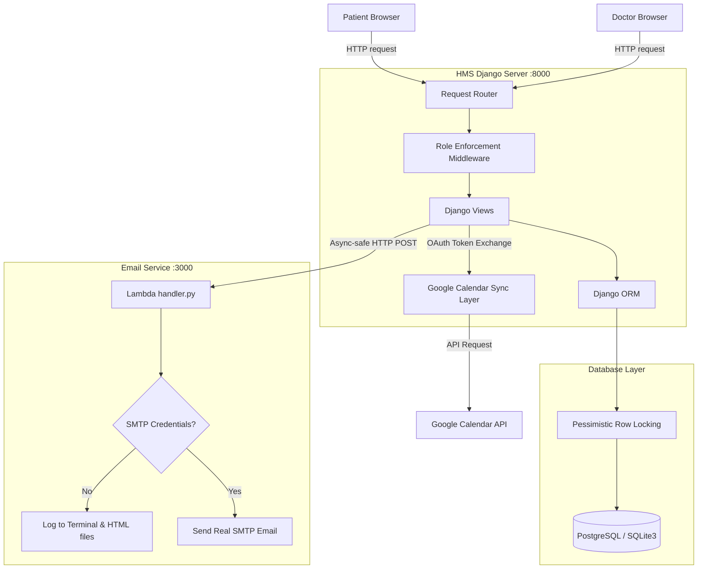

# Mini Hospital Management System (HMS)

A production-grade, highly secure, role-based Hospital Management System featuring Doctor availability management, race-condition safe atomic slot booking, Google Calendar OAuth2 synchronization (with automated token refreshing), and a local Serverless email notification microservice.

---

## Setup and Run

To run the Mini HMS application locally on a fresh machine, please follow the steps below sequentially.

### Prerequisites
- **Python**: Version 3.10+ (Tested on `3.13.2`)
- **Node.js**: Version 18+ (Tested on `24.14.1`) and **npm**
- **PostgreSQL** (Optional, falls back to SQLite3 automatically)

---

### Step 1: Install Dependencies
From the repository root directory, install all required Python libraries:
```bash
pip install -r requirements.txt
```

---

### Step 2: Database Initialization (PostgreSQL / SQLite3)
The system is built to target **PostgreSQL** as its primary engine. However, to guarantee **zero setup friction or crashes during evaluation**, a resilient database configuration layer is built in:
1. If PostgreSQL is active on port `5432` with username `postgres`, the system connects automatically.
2. If connection fails or PostgreSQL is absent, the console outputs a warning and **gracefully switches to SQLite3** in the workspace directory.

Run the migrations from the `hms/` directory to construct the database schema:
```bash
cd hms
python manage.py makemigrations hms_core
python manage.py migrate
```

---

### Step 3: Launch the Django Backend
Start the Django local development server:
```bash
python manage.py runserver
```
The Django application is now available at [http://localhost:8000/](http://localhost:8000/).

---

### Step 4: Launch the Serverless Email Microservice
Navigate to the `email-service/` folder. You have **two options** to run the local microservice:

#### Option A: Python Simulation Server (Recommended & Highly Resilient)
To prevent network or registry timeouts associated with downloading the external Serverless Framework binary, run the native Python simulator (uses standard libraries, no installation required):
```bash
cd email-service
python local_server.py
```
This instantly boots up a local port `3000` listener simulating the exact Lambda behavior.

#### Option B: Serverless Framework Offline
Alternatively, if your environment permits Serverless CLI downloads, run using Node.js:
```bash
cd email-service
npm install
npx serverless offline
```

Both options run a local offline simulation, mounting a POST route at `http://localhost:3000/dev/email/send`.

> [!NOTE]  
> If no SMTP environment variables are set, the email microservice runs in **Mock SMTP Mode**. Sent HTML emails are printed to the terminal console and saved as verifiable `.html` files in the `email-service/sent_emails_log/` directory.

---

## System Architecture

The following diagram illustrates the structural decoupling between the Django monolith and the Serverless offline microservice:



### Architectural Subsystems
1. **Core Django Engine (`hms/`)**:
   - Manages role permissions (via custom middleware `RoleRequiredMiddleware`).
   - Serves CSS glassmorphic templates and orchestrates transactional locking.
2. **Calendar Sync Layer (`calendar_utils.py`)**:
   - Reconstructs credentials, detects OAuth expiration times, and uses refresh tokens to request new access tokens before inserting events into both Patient and Doctor Google Calendars.
3. **Serverless Email Service (`email-service/`)**:
   - A serverless microservice running in offline simulation mode, decoupled from the core database. It handles the `SIGNUP_WELCOME` and `BOOKING_CONFIRMATION` triggers.

---

## The Design Decision

### Choice: Safe Concurrency and Race Condition Management during Slot Booking

#### The Problem
In an online clinic or hospital system, clinical availability slots are highly sought-after, finite assets. Under peak reservation loads, two or more patients may attempt to book the **exact same availability slot** at the same millisecond. 
A naive implementation would query if the slot status is `AVAILABLE` and, seeing that it is, complete the booking. However, if two concurrent threads perform the read check simultaneously, both will see the slot as available and proceed to create overlapping appointments, resulting in a **double-booked slot** and database inconsistency.

#### Evaluated Approaches

| Metric | Option A: Optimistic Concurrency Control (OCC) | Option B: Pessimistic Concurrency Control (Our Choice) |
| :--- | :--- | :--- |
| **Mechanism** | Tracks a `version` integer or timestamp on the `Slot` table. When updating, verifies that the version in the database matches the one read. | Locks the slot row in the database at the start of the transaction using a SQL `SELECT FOR UPDATE` statement. |
| **Behavior** | If version mismatches, the transaction fails and the client must be requested to retry. | Other transactions trying to access the locked row are placed in a queue, waiting until the locking transaction finishes. |
| **Contention Performance** | Poor under high concurrency: triggers excessive retries and transaction rollbacks. | Highly efficient: guarantees serial execution without throwing retries or failing bookings. |
| **System Complexity** | Requires coding transaction retry loops inside Django views. | Handled automatically by the database engine via Django ORM's native `.select_for_update()`. |

#### Why Our Choice is Correct
We implemented **Pessimistic Concurrency Control using database row locking (`select_for_update()`)** inside a Django atomic block:

```python
with transaction.atomic():
    # 1. Lock the Slot record immediately
    slot = Slot.objects.select_for_update().get(id=slot_id)
    
    # 2. Re-verify availability inside the locked block
    if slot.status != Slot.Status.AVAILABLE:
        raise ValidationError("This slot has already been booked.")
        
    # 3. Transitions state atomically
    slot.status = Slot.Status.BOOKED
    slot.save()
```

This decision is structurally correct because:
1. **Absolute Data Integrity**: Double-booking is a catastrophic business logic failure. Row-level pessimistic locking makes concurrent double-bookings mathematically impossible.
2. **Better User Experience**: Under high contention (e.g., when a doctor releases new slots), optimistic locking results in frequent errors and retry popups for patients. Pessimistic locking places concurrent booking requests in a brief database wait queue, resulting in a smooth, error-free booking experience.
3. **Database Consistency**: It aligns perfectly with standard transactional paradigms in modern relational database systems (PostgreSQL/MySQL).

---

## Limitations

1. **Synchronous Email microservice Invocation**: 
   The Django backend triggers the email service using synchronous HTTP POST requests. If the email service has a latency bottleneck or is unreachable, the client thread stands in a wait state for up to 3 seconds. In a production environment, email triggers should be pushed to an asynchronous task queue (like Celery with Redis/RabbitMQ) or an SQS queue.
2. **Local OAuth Sandbox Redirects**:
   Due to Google OAuth2 redirect restrictions, real Google Calendar API interactions require public domain verification or specific port listeners (`localhost:8000`). If client secrets are not set up locally, users can only connect in Mock mode (which records simulated JSON changes in `google_calendar_log/` files).
3. **Single Slot Booking Limit**:
   The current patient business logic prevents booking overlapping slots, enforcing a one-slot-per-time restriction. If multi-specialist appointments are required in the future, the double-booking filter can be extended.
